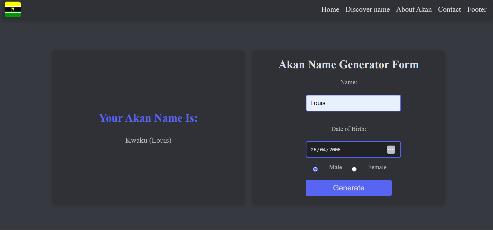
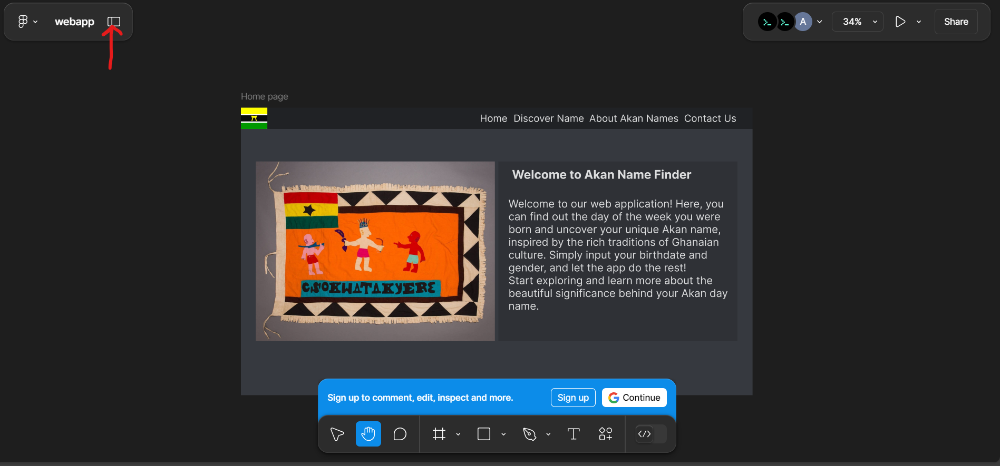
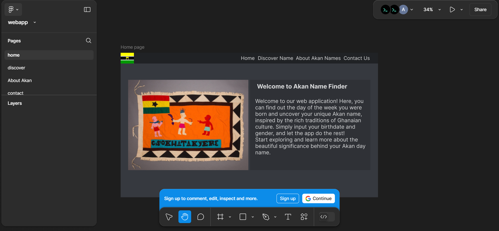

# Akan Name Finder web app
## Project description
The Akan Name Finder is a web application inspired by the rich traditions of Ghanaian culture. It allows users to input their birthdate and gender to discover their unique Akan name, derived from the day of the week they were born. Akan names hold deep cultural significance, reflecting the soul and character of the individual.

The app also serves as an educational tool, explaining the Akan naming system and its historical context.
## Developer Information
Author: Louis Maina
GitHub: studentdev-glitch
Email: louis.maina@student.moringaschool.com


## Live Project
You can view the live project here: [Live Akan Name finder Website](https://studentdev-glitch.github.io/AkanNameCalculator/#footer) # Akan Name finder web app.

## Screenshot
This is a screenshot of the form and display of Akan name


## Installation
To get this project up and running on your local machine, follow these steps:

1. Clone the repository:
    ```sh
    git clone https://github.com/studentdev-glitch/AkanNameCalculator.git
    ```
2. Navigate to the project directory:
    ```sh
    cd AkanNameCalculator
    ```
3. Open `index.html` in your browser to view the website or u can use live server a visual studio extension to run it on a browser which has feature of hot reload reducing devlopment time from refreshing the web page when making changes

## Behavior-Driven Development (BDD)
| Behavior                                          | Second Header                               | Second Header |
| ------------------------------------------------- | --------------------------------------------| ------------- |
| User enters their name, date of birth, and gender | Name: Louis, DOB: 2006-27-04, Gender: Male  | Output: "Your Akan Name Is: Yaw (Louis)"    |
| User fails to fill all fields                     | Missing DOB or gender                       | Alert: "Please fill out all fields!"   |
| Invalid date input                                | Invalid format or empty                     | Alert: "Please enter a valid date!" |

## Features
This project is a website designed using HTML and CSS and JS. The goal is to provide a functional and visually appealing l.

## Technologies Used
1. HTML5: For structuring the web app.
2. CSS3: For styling and layout.
3. JavaScript (ES6): For application logic and dynamic content.
4. Git: For version control.
5. Figma (Design): For prototyping and UI design
6. Vs code whcih is for coding the whole web app project


## Contributing
We welcome contributions! If you'd like to improve or add features, feel free to fork this repository and submit a pull request. Please follow these steps:

1. Fork the repo
2. Create a new branch:
    ```sh
    git checkout -b feature-branch
    ```
3. Make your changes
4. Commit your changes:
    ```sh
    git commit -am 'Add new feature'
    ```
5. Push to the branch:
    ```sh
    git push origin feature-branch
    ```
6. Open a pull request

## Design
The website wireframe was possible through a website: Figma
[Figma wireframe link](https://www.figma.com/design/Bnq8l5R6rx8IR11NKAYWfT/webapp?node-id=0-1&p=f)
#### Figma navigation help
##### Click the button which is illustrated from the red arrow to view other page wireframe design

##### This will then dsiplay these image where u can toggle between the different wire frame pages 


License and Copyright
MIT License
© 2025 Louis Maina.

#### License Information
License Type: MIT License
Permissions:
- Commercial use
- Modification
- Distribution
- Private use

Copyright Statement
© 2025 Louis Maina. All Rights Reserved.

#### Copyright Details

Original Creator: Louis Maina
Year of Creation: 2025
Rights: Full copyright protection under international copyright laws

### Usage Rights

#### Permitted:
- Personal use
- Educational purposes
- Non-commercial applications

#### Restricted:
- Selling without permission
- Claiming as original work
- Removing original copyright notice

#### Contact for Permissions
GitHub: studentdev-glitch
Email: louis.maina@student.moringaschool.com

